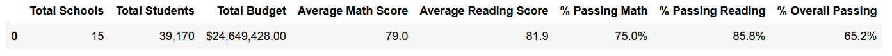
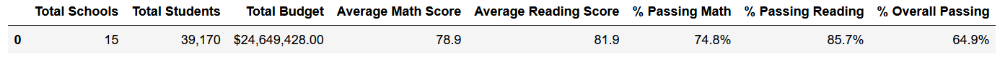
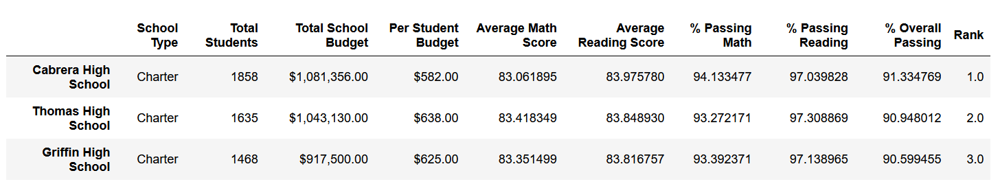
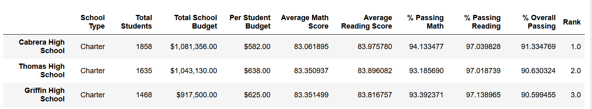
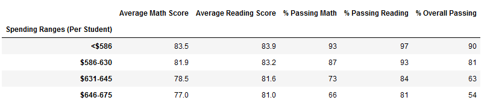
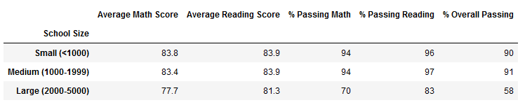
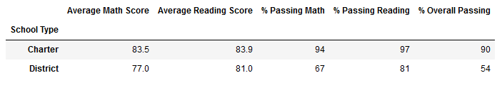

# School District Analysis

The aim of this analysis is to compute and present a high-level snapshot of school performance within a school district.  School performance will be judged on a key output, student performance. 

The key performance measures defined for this district include the following: 

### KPIs:

- Top 5 and bottom 5 performing schools, based on the overall passing rate
- The average math score received by students in each grade level at each school
- The average reading score received by students in each grade level at each school
- School performance based on the budget per student
- School performance based on the school size 
- School performance based on the type of school

## Special Requirements

A specific requirment of this analysis was to strip out the effects of one grade at one high school (Grade 9 Students at Thomas High Scool), due to data quality concerns at that grade level/school. The reporting below will compare the pre and post adjusted results and discuss any impacts of the questionable data.

## Results

### District Summary

District results were marginally impacted after dropping the questionable scores.  Average math scores droped a tenth of a percent, though average reading scores remained unchanged.  The percentage of students passing math/reading and combined showed decreases across the board,  falling 2, 1 and 3 tenths of a percent respectively.

The original district results: 


The adjusted district results: 


### School Summary

School results, being specific to each school, only change for the one school with data issues, Thomas High School.
Reading scores went up slightly, while the math score, as well as all pass rates, declined slightly after excluding the questionable scores.

Original school results


Adjusted school results: 


Note: Formatting the school output was achived using the following code:
```
per_school_summary_df.loc['Thomas High School'].to_frame().apply(lambda x: map(lambda x:'{:.1f}%'.format(x),x) if ('Passing' in x.name or 'Score' in x.name) else x, axis=1)
```
found at [stack overflow](https://stackoverflow.com/questions/23981601/format-certain-floating-dataframe-columns-into-percentage-in-pandas) 

### School Summary - Rankings

School relative performance for Thomas was not impacted by the data issue.  As shown below, the school ranked second before and after adjustment.

Original results:



Adjusted results:



Rank was added temporarily using the rank method with assign:
```
per_school_summary_df.sort_values(by='% Overall Passing',ascending=False).assign(Rank=per_school_summary_df['% Overall Passing'].rank(ascending=False))
```
### School Results by Grade:

Results for both math and reading were not impacted for any school except Thomas High School. At Thomas, the grade 9 results were removed from analysis, so appear as nan, instead of a number. The results at Thomas in all other grades were unchanged, and the results of all other school were unchanged.
This is expecated based on the changes made to the data.

### School Results by Spending

There are no discernable changes to the results by spending level. Thomas High School, as seen from the above table, fits in the $631-645 category of per student spending, and all numbers in that category (at the rounding level shown in the table) are identical before and after the adjustment.



### School Results by Size

Thomas, having a population of 1635 students (and still over 1000 after excluding grade 9 students) belongs in the 'Medium' size category for schools. There are once again no discernable differences between the unadjusted and adjusted results. School performance by size can been seen below:



### School Results by Type

Thomas is a charter school, and as per the previous two cases, there are no discernable differences in the results pre and post adjustment.  Performance by school type can be seen below:



## Conclusion

The overall impact on school performance measures from excluding grade 9 scores from Thomas High School was minimal.  Results by school size, type, and budget per student were not impacted. On a relative basis, Thomas retained it's rank as second best performing school following the adjustment.
Changes in metrics were visible in the following categories:
 - At the district level:
 1. Average math scores droped 0.1%.
 2. The percentage of students passing math dropped 0.2%.
 3. The percentage of students passing reading dropped 0.1%.
 4. The percentage of students passingg overall dropped 0.3%.
 
 - At the school level:
1. Average math scores dropped by 0.06%
2. Average reading scores increased by 0.05%
3. The percentage of students passing math dropped by 0.09%
4. The percentage of students passing reading dropped by 0.29%
5. The percentage of students passing overall dropped by 0.32%
